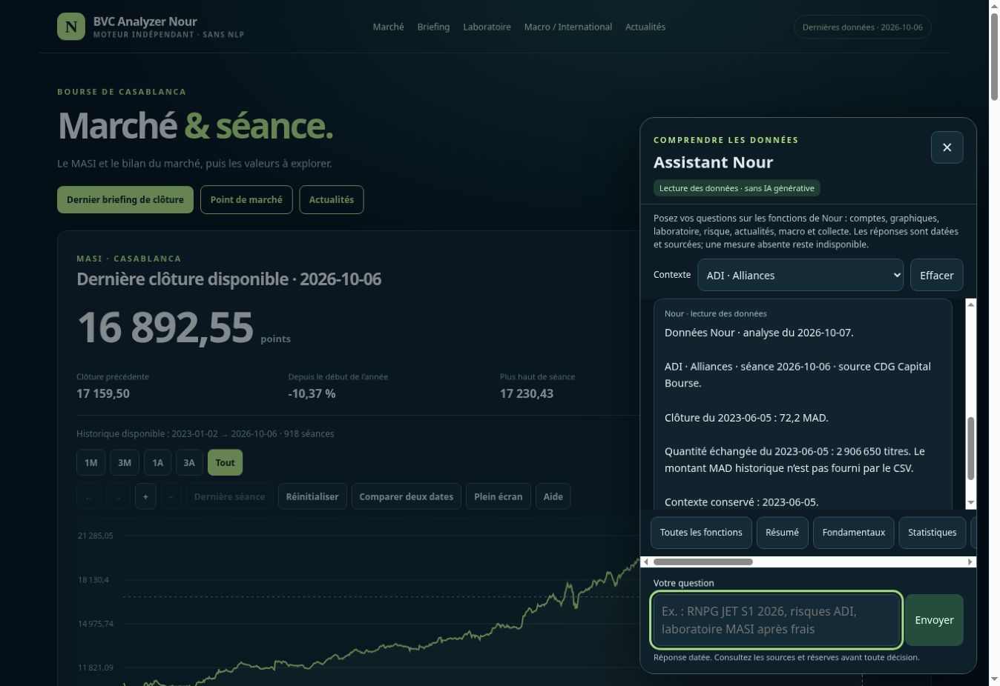

# Essais de conversation sur Nour publié — 7 octobre 2026

Les essais ont été effectués directement dans la fenêtre de l’assistant du site
public, par saisie de questions puis lecture des réponses affichées. Ils ont
complété les tests de fonctions du lot précédent : une question isolée correcte
ne prouvait pas que la conversation conservait tous ses sujets et périodes.

## Défauts reproduits et corrections

| Conversation testée | Défaut observé sur la version précédente | Correction |
|---|---|---|
| Compare PER ADI/RDS → Et leur BPA ? | Seul ADI était conservé | Les deux titres restent dans le contexte des relances |
| RNPG JET premier semestre 2026 → Et le résultat total ? | Retour aux comptes annuels 2025 | S1 2026 est conservé : le total publié est distinct du RNPG |
| Bougie ADI 05/06/2023 → Et le volume ? | Volume de la dernière séance | La quantité de la date historique est lue dans le même CSV vérifié ; montant MAD absent explicite |
| Risques ADI face au MASI → Que veut dire bêta ? | MASI compté comme second sujet, ancien contexte JET maintenu ; aucune définition | MASI devient le repère de risque, ADI le sujet ; les formulations d’explication usuelles sont reconnues |
| À quoi sert le laboratoire ? | Tableau de résultats au lieu d’une explication | Réponse avec le fonctionnement simple et les limites |
| Résume le briefing de clôture, avec ADI sélectionné | Uniquement le commentaire ADI | Synthèse générale par défaut ; commentaire de titre lorsqu’il est demandé explicitement |
| Dernière clôture du 06/10, consultation dans la nuit du 07/10 | Avertissement de donnée ancienne lié au changement de date d’analyse | La fraîcheur du titre se compare à la dernière clôture du marché ; une fiche réellement antérieure reste signalée |

Une question autonome avec un nouveau titre/périmètre n’hérite pas du semestre
précédent. Le choix manuel d’un titre et le bouton Effacer réinitialisent le
contexte. Une mesure historique absente ne reçoit pas sa valeur actuelle à la
place. La période reprise est affichée dans la réponse.

Les scores, ratios, historiques et documents financiers ne sont pas modifiés.
La correction concerne uniquement la résolution des sujets/périodes, les
explications et la sélection d’une synthèse déjà publiée. Le modèle génératif
reste désactivé et le dépôt principal reste intact.

## Validation

- 30 régressions de conversations naturelles reproduisant les problèmes et
  leurs cas voisins : deux titres, S1 et comparatif, nouvelle question, date de
  volume, indicateur historique absent, définition, frais et reset de contexte.
- Les 320 scénarios de base, 29 réponses précises et 419 réponses de domaines
  du lot précédent restent testés.
- Suite Python et audits du dépôt : 132 tests réussis, 89 pages contrôlées et
  parité des exports de l’assistant avec le rapport.
- Parcours Chromium étendu avant/après publication, à 375, 768 et 1 440 pixels :
  ces relances sont saisies dans la vraie interface et comparées aux données sources.

Les formulations reconnues restent déterministes. Ces vérifications ne sont
ni une garantie de compréhension de toute phrase libre, ni un audit complet
d’accessibilité, ni une validation prédictive des scores.

## Publication et reprise des essais sur le site public

Correction publiée : `8147489f1cb9ff52512676475e450b1e37992e0e`.
Le [workflow 37556768398](https://github.com/abdmoutalib207-lang/bvc-analyzer-nour/actions/runs/37556768398)
est terminé avec succès. Les journaux attestent 132 tests Python, 320 scénarios
de base et 29 réponses précises, 419 contrôles de domaines, 30 régressions de
conversation et 89 pages auditées. Les 12 parcours page/largeur Chromium ont
réussi avant déploiement puis sur le site réellement publié, aux trois largeurs
375, 768 et 1 440 pixels. La seconde vérification s’est achevée à
2026-10-07T01:25:22Z. Les captures de CI sont conservées dans l’artefact
`nour-assistant-browser-qa` du workflow.

Après rechargement du site public, les conversations ont aussi été reprises
manuellement par saisie dans la fenêtre, puis lecture des réponses affichées :

| Question ou relance | Résultat affiché après publication |
|---|---|
| PER ADI/RDS → Et leur BPA ? | Les deux titres sont conservés ; BPA ADI 18,46 MAD et RDS indisponible |
| Risques ADI face au MASI → Que veut dire bêta ? | ADI reste le sujet ; bêta 1,53 et définition fournie |
| À quoi sert le laboratoire ? | Explication du fonctionnement, frais et limites, sans lancer un tableau de résultats |
| RNPG JET S1 2026 → résultat total → minoritaires | 91,51 / 103,60 / 12,09 MDH, toujours à la période 2026-06-30, avec les réserves du document |
| Bougie ADI 05/06/2023 → Et le volume ? | 2 906 650 titres au 2023-06-05 ; montant MAD historique signalé absent |
| Briefing de clôture avec ADI sélectionné → Briefing ADI | Synthèse générale MASI puis commentaire du titre explicitement demandé |
| Laboratoire ADI 20 séances, frais 1 % / 1 % → 60 séances, glissement 0,2 % | Frais 1 % / 1 % conservés ; nouvel horizon et glissement repris ; petits échantillons signalés |
| Choix manuel JET → Et son BPA ? | Contexte remis à zéro : JET annuel 2025, BPA 73,39 MAD indicatif, sans héritage du laboratoire ou du semestre |

La capture ci-dessous montre la relance de volume conservant la date historique.
Les réponses financières restent longues : leur présentation peut être simplifiée
sans supprimer les réserves. Aucun audit supplémentaire des comptes ni activation
de modèle génératif n’est impliqué par cette correction conversationnelle.

