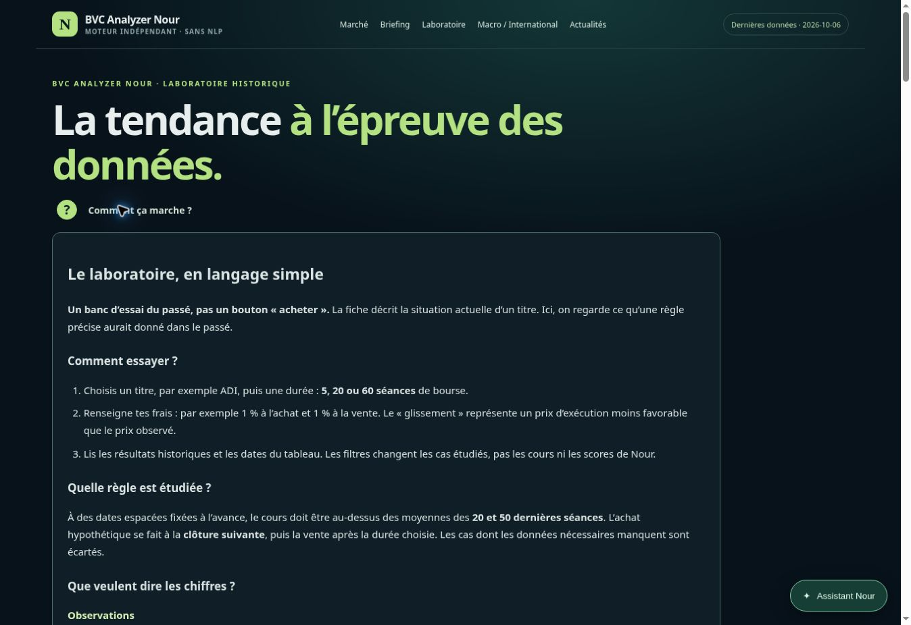

# Aide simple du laboratoire — 6 octobre 2026

Un cercle « ? / Comment ça marche ? » ouvre une explication en français courant
sur la page du laboratoire. Le composant HTML details/summary fonctionne sans
JavaScript ; avec JavaScript, le bouton Fermer et Échap rendent le focus au « ? ».
La zone tactile mesure au moins 44 px de hauteur. Aucun nouveau paquet ni modèle
IA n'est nécessaire ; les calculs, fondamentaux et le moteur principal sont inchangés.

Code : `b71030b4f7f49ff9a9afd514e07fc625c49e1354`. Correctif du contrôle CSV :
`8011b5af037166d416edf8bc755560eb2d158b3f`. Publication et contrôles avant/après :
workflow `37510596505`, réussi. La page réellement servie a également été ouverte
et son aide cliquée dans le navigateur cloud.

- 124 tests Python et gate Python/JS/audit réussis, y compris sur la collecte du 6 octobre.
- 12 parcours Chromium sur quatre pages et trois largeurs (375, 768, 1440 px),
  avant puis après déploiement. L'aide est testée au clic, Entrée, Espace, Échap,
  fermeture, retour du focus et conservation des filtres/résultats.
- 3 parcours supplémentaires sans JavaScript par exécution.
- Captures CI conservées dans l'artefact du workflow ; aperçu ci-dessus archivé ici.
- Safari/iPhone physique, audit WCAG complet et régression visuelle avec un
  référentiel approuvé : non mesurés. Le navigateur local n'a pas pu être installé,
  les tests réels Chromium ont été exécutés dans GitHub Actions.

Deux blocages préexistants de publication ont été corrigés sans changer le moteur :
les tests de rapprochement JET/HAL/etc. utilisent la date du snapshot courant
pour vérifier les informations actuelles, au lieu du 5 octobre figé (les garde-fous
historiques restent testés séparément) ; .gitattributes reconnaît les fins CRLF
standard des exports CSV sans désactiver les autres contrôles d'espaces.
